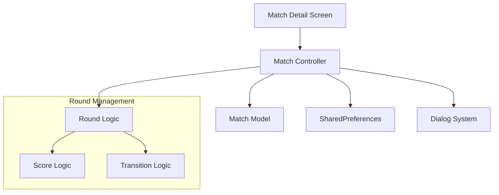
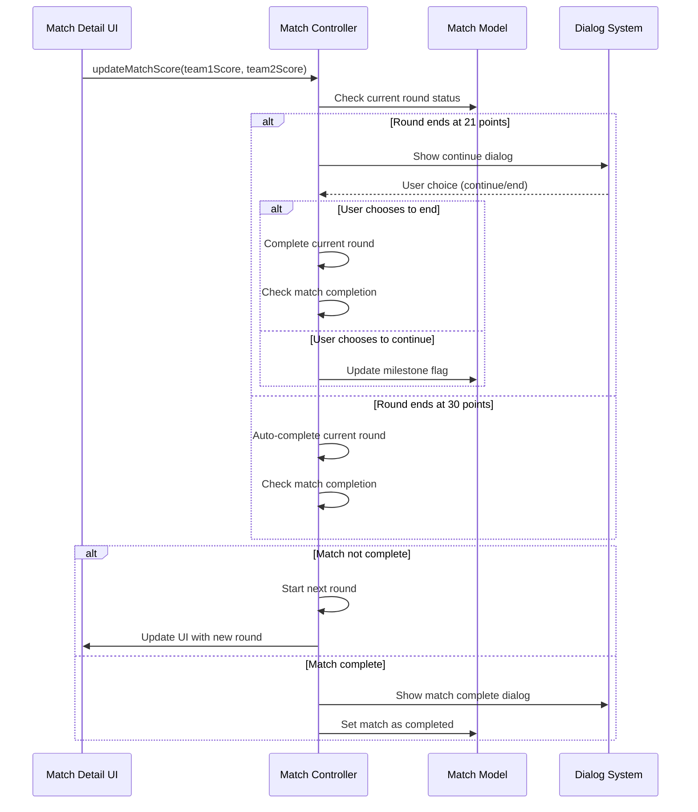

# Design Document: Multi-Round Badminton Matches

## Overview

This design implements proper 3-round badminton match functionality in the existing Flutter app. The current system supports only single-round matches with 21/30 point logic and popup dialogs. The new system will extend this to support best-of-3 rounds while maintaining all existing UI patterns and scoring logic.

The design leverages the existing `MatchModel` structure (which already contains multi-round fields) and extends the `MatchController` to handle round transitions, match completion logic, and UI updates for displaying round progress.

## Architecture

### High-Level Architecture



### Component Interaction Flow



## Components and Interfaces

### Enhanced Match Model

The existing `MatchModel` already contains the necessary fields for multi-round support:

```dart
class MatchModel {
  // Existing fields remain unchanged
  final int currentRound; // Current round (1, 2, or 3)
  final List<int> team1RoundWins; // Rounds won by team 1  
  final List<int> team2RoundWins; // Rounds won by team 2
  final List<Map<String, int>> roundScores; // Score history for each round
  final String? winner; // Overall match winner
  
  // New computed properties needed
  bool get isMatchComplete;
  String get matchWinner;
  int get team1RoundsWon;
  int get team2RoundsWon;
  Map<String, int> get currentRoundScore;
}
```

### Enhanced Match Controller

The existing `MatchController` will be modified to add multi-round logic directly within the existing `updateMatchScore` method and add helper methods:

```dart
class MatchController extends GetxController {
  // Existing methods remain unchanged
  
  // Modified updateMatchScore method will handle:
  // - Round completion detection
  // - Round winner determination  
  // - Match completion checking
  // - Automatic round transitions
  
  // New helper methods added to existing controller:
  void _completeCurrentRound(String matchId, String roundWinner);
  void _startNextRound(String matchId);
  bool _isMatchComplete(MatchModel match);
  String _determineMatchWinner(MatchModel match);
  void _showRoundCompleteDialog(String matchId, String roundWinner, int roundNumber);
}
```

### UI Components

Enhanced UI components will be added directly to the existing `MatchDetailScreen`:

```dart
// New methods to be added to existing MatchDetailScreen class
Widget _buildRoundProgressHeader(MatchModel match);
Widget _buildRoundScoreHistory(MatchModel match);
Widget _buildCurrentRoundIndicator(MatchModel match);

// Existing _buildScoreSection method will be modified to show round context
// Existing _buildMatchHeader method will be modified to show round progress
```

## Data Models

### Enhanced Match Model Usage

The existing `MatchModel` already contains all necessary fields for multi-round support. We will utilize these existing fields more effectively:

- `currentRound`: Tracks active round (1-3) 
- `team1RoundWins`: List of round numbers won by team 1
- `team2RoundWins`: List of round numbers won by team 2
- `roundScores`: List of `Map<String, int>` containing score history for each completed round
- `team1Score`/`team2Score`: Current round scores (reset each round)
- `milestone21Reached`: Reset each round for popup logic
- `winner`: Overall match winner (set when match completes)
- `isCompleted`: Set to true when match ends (2 rounds won)

### Match State Management

The existing model's computed properties will be enhanced:

```dart
// Existing properties that will be used:
bool get isRoundComplete; // Modified to work with multi-round logic
bool get isMatchComplete; // Modified to check for 2 round wins
String get currentRoundWinner; // Enhanced for round winner logic

// New computed properties to be added:
int get team1RoundsWon => team1RoundWins.length;
int get team2RoundsWon => team2RoundWins.length;
Map<String, int> get currentRoundScore => {'team1': team1Score, 'team2': team2Score};
String get matchWinner; // Determine overall match winner
```

## Correctness Properties

*A property is a characteristic or behavior that should hold true across all valid executions of a system-essentially, a formal statement about what the system should do. Properties serve as the bridge between human-readable specifications and machine-verifiable correctness guarantees.*

Let me analyze the acceptance criteria to determine testable properties:

### Property 1: New Match Initialization
*For any* new match creation, the match should initialize with round 1, empty round win lists, empty round score history, and 0-0 current scores
**Validates: Requirements 1.1, 7.3**

### Property 2: Round Number Bounds
*For any* match state during gameplay, the current round number should always be between 1 and 3 inclusive
**Validates: Requirements 1.2**

### Property 3: Round Score Reset on Transition
*For any* match transitioning to a new round, the current round scores should be reset to 0-0 while preserving all historical round data
**Validates: Requirements 2.5, 3.5**

### Property 4: Match Score Consistency
*For any* match state, the match score (rounds won by each team) should always equal the length of their respective round wins lists
**Validates: Requirements 1.4, 3.1**

### Property 5: Automatic Round Progression
*For any* match where a round ends and neither team has 2 round wins, the system should automatically start the next round
**Validates: Requirements 1.5, 3.2**

### Property 6: Twenty-One Point Dialog Trigger
*For any* round where a team first reaches exactly 21 points, the system should trigger the continue dialog (unless already triggered in that round)
**Validates: Requirements 2.1**

### Property 7: Thirty Point Auto-End
*For any* round where a team reaches 30 points, the round should automatically end with that team as the winner
**Validates: Requirements 2.2**

### Property 8: Round Winner Determination
*For any* completed round, the team with the higher score should be correctly identified as the round winner
**Validates: Requirements 2.3, 2.4, 4.2**

### Property 9: Match Completion on Two Wins
*For any* match where a team reaches 2 round wins, the entire match should immediately end with that team as the overall winner
**Validates: Requirements 3.3, 4.1**

### Property 10: Completed Match Immutability
*For any* completed match, attempts to update scores or progress rounds should be rejected and the match state should remain unchanged
**Validates: Requirements 4.3**

### Property 11: Data Preservation and Integrity
*For any* match throughout its lifecycle, all completed round scores, match scores, and historical data should be preserved and never lost during transitions or operations
**Validates: Requirements 3.4, 4.4, 6.1, 6.2, 6.3, 6.4, 6.5**

### Property 12: UI Rendering Completeness
*For any* match state, the UI rendering should include current round number, match score, all completed round scores, and current round score
**Validates: Requirements 5.1, 5.2, 5.3, 5.4**

### Property 13: Legacy Match Compatibility
*For any* existing single-round match data, the system should correctly interpret it as a completed 1-round match and display it appropriately
**Validates: Requirements 7.1, 7.2, 7.4**

### Property 14: Match Type Distinction
*For any* match list display, legacy single-round and new multi-round matches should be clearly distinguishable in the UI
**Validates: Requirements 7.5**

### Property 15: Serialization Round Trip
*For any* match with multi-round data, serializing then deserializing should produce an equivalent match object with all round data intact
**Validates: Requirements 6.5**

## Error Handling

### Round Transition Errors
- **Invalid Round Numbers**: System should reject attempts to set round numbers outside 1-3 range
- **Score Update on Completed Match**: System should reject score updates on completed matches
- **Invalid Round Winners**: System should validate that round winners correspond to actual score leaders

### Data Consistency Errors
- **Mismatched Round Data**: System should detect and handle cases where round wins don't match round score history
- **Corrupted Match State**: System should provide fallback behavior for corrupted match data
- **Storage Failures**: System should handle SharedPreferences failures gracefully

### UI Error States
- **Missing Match Data**: UI should display appropriate error messages for missing or corrupted matches
- **Invalid Round Display**: UI should handle edge cases where round data is inconsistent
- **Dialog State Management**: System should prevent multiple dialogs from appearing simultaneously

## Testing Strategy

### Dual Testing Approach

The testing strategy employs both unit tests and property-based tests to ensure comprehensive coverage:

**Unit Tests** focus on:
- Specific examples of round transitions (1-0 to 1-1 to 2-1)
- Edge cases like 21-point dialogs and 30-point auto-ends
- Integration between UI components and controller methods
- Error conditions and boundary cases
- Legacy data migration scenarios

**Property-Based Tests** focus on:
- Universal properties that hold across all match states and transitions
- Comprehensive input coverage through randomized match scenarios
- Data integrity properties across serialization/deserialization
- UI rendering consistency across all possible match states

### Property-Based Testing Configuration

- **Framework**: Use the `test` package with custom property generators for Flutter/Dart
- **Iterations**: Minimum 100 iterations per property test to ensure thorough coverage
- **Test Tagging**: Each property test tagged with format: **Feature: multi-round-badminton-matches, Property {number}: {property_text}**
- **Data Generators**: Custom generators for MatchModel instances, score sequences, and round transitions
- **Shrinking**: Implement custom shrinking to find minimal failing examples

### Test Data Generation

```dart
// Example property test structure
testProperty('Property 1: New Match Initialization', (test) {
  // Feature: multi-round-badminton-matches, Property 1: New Match Initialization
  forAll(matchCreationDataGenerator, (matchData) {
    final match = MatchModel.create(matchData);
    return match.currentRound == 1 && 
           match.team1RoundWins.isEmpty && 
           match.team2RoundWins.isEmpty &&
           match.roundScores.isEmpty &&
           match.team1Score == 0 &&
           match.team2Score == 0;
  });
});
```

### Integration Testing

- **Controller-Model Integration**: Test that MatchController correctly updates MatchModel state
- **UI-Controller Integration**: Test that UI components correctly reflect controller state changes
- **Storage Integration**: Test that match data persists correctly through app restarts
- **Dialog Integration**: Test that dialog flows correctly update match state

### Performance Testing

- **Large Match History**: Test app performance with hundreds of completed matches
- **Rapid Score Updates**: Test system behavior with rapid score increment/decrement operations
- **Memory Usage**: Monitor memory usage during extended match sessions